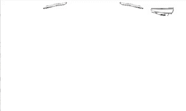
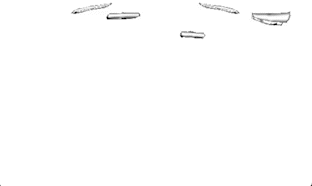

# VR-coursework

Implementation for 3rd year Virtual and Augmented Reality coursework

## Marks
**Implementation** - 80/80. Feedback: 'Perfect implementation'

**Report** - 17/20

**Overall** - 97%

Please see the PDF document for more information on what was required.

Output render with 3 headsets:

Output render with 5 headsets to show collision handing in all axes (rotating at twice the speed because why not):

**Note**: artefacts and the precense of missing triangles are a result of the simple rendering technique used and was not an area of focus for this coursework.

The physics implementation included the effects of gravity and drag. The Physics implemented also caters for a simple bounce when the object hits the floor (y velocity component is negated). However, this is not clearly visible in the video as the headset weight and velocity weren't set to demonstrate this.